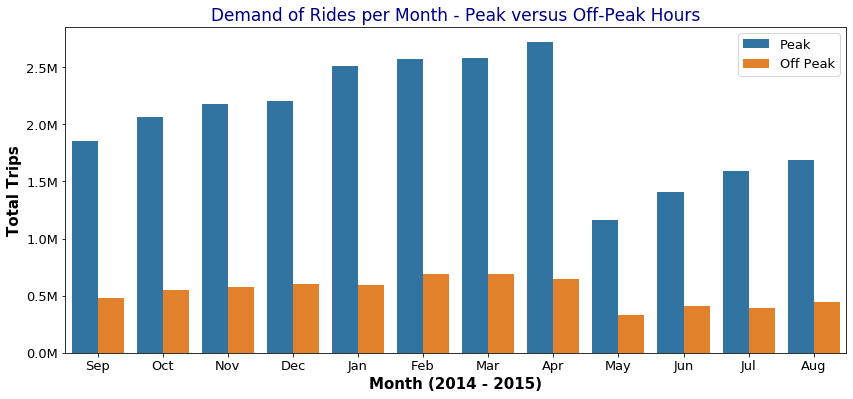
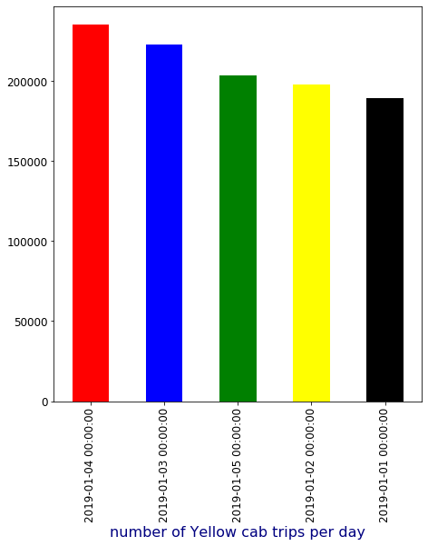
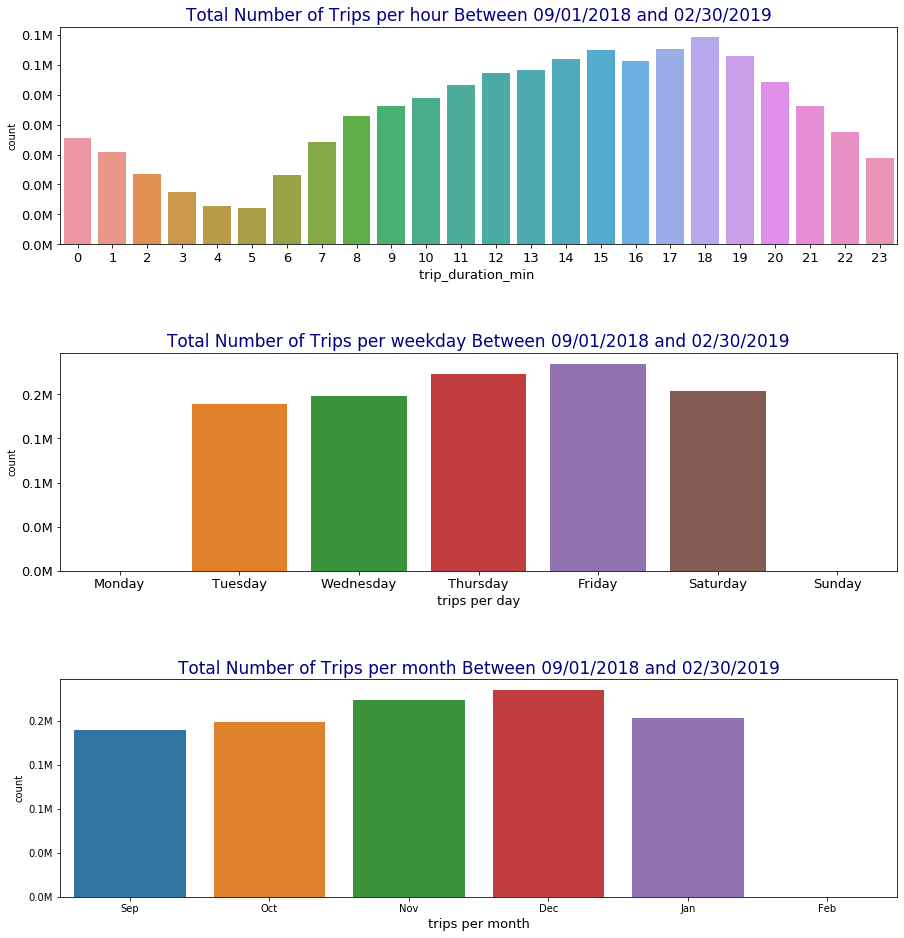
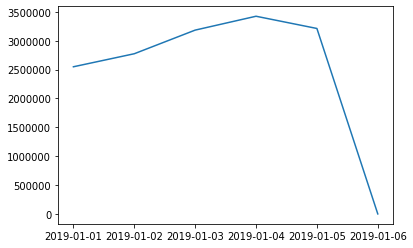

# IS 590PR Final Project - Type 2

## Project Name:
Cab Service Data Analysis of NYC data

## Group members:
Ishita Ghosh (ishita2019) 
Dipika Jiandani (dipika7) 
Sayali Mohite (mohite2) 

## Project Discription:
Yellow Cabdrivers are struggling to survive in the era dominated by Uber and striving to fight a losing battle. New York yellow cab service has the largest cab fleets in the US & they are facing extinction. According to reports, approximately 40% of the 7000 strong cab fleet had not had an average rate.

## Hypothesis 1 
Metropolitan areas of NYC have higher tipping rates considering the income level of the people living in these areas. 
## Analysis
We have analyzed, the relationship between pick-off locations of trips and corresponding tipping rates.This is achived by mergering the yellow trip 2019 dataset with taxi-lookup dataset to get the pick-up location in particular zone. After detailed analysis, we can concluded that Metropolitan areas of NYC have lower tipping rates with respect to the income level of the people.

1a: Finding out the relationship between tipping rates and the Pick up and Drop off locations  

1b: Determining the most popular pick up and drop off locations in NYC  

1c: Analyzing if there's a correlation between tipping rates and the weekdays  

## Hypothesis 2 
Relationship between number of uber trip and cumulative revenue Growth for Uber dataset.

## Analysis
We have analyzed, the relationship Uber trips and revenue growth.We have also taken weekends/holidays into consederation. After detailed analysis, we can concluded that the number of uber trips are increasing month over month with corresponding increase in the cumulative revenue growth.

2a: Visualizing the demand: number of Uber trips per day. 

2b: The effect of time on demand for Uber rides: distribution per month(Peak hours versus Off-Peak hours). 

2c: Month over Month Base Revenue Growth: how fast has Uber grown in the period?  

2d: Cummulative Revenue Growth Percentage for Uber cab service.

## Hypothesis 3
Drop in the revenue growth for NYC Yellow cab service in the era dominated by for-hire-service. 
## Analysis
We have observed, the demand of yellow cab service daily basis, increase in demand on monthly basis,and it's revenue growth month over month.We have considered the time slot of 365 days of 2019. After detailed analysis, we can concluded that the number of yellow cab trips are increasing month over month while the average estimated revenue is decreasing.

3 a: Visualizing the demand: number of Yellow Cab trips per day. 

3 b: Estimating the effect of time on demand for Yelow Cab serive: distribution per hour, weekday, and month  

3 c: Analyzing Monthly Base Revenue: The NYC market worth in the period

Here we can see that the number of trips are increasing month over month while the average revenue is decreasing.Hence, we can accept the Hypothesis.

## Datasets used:
https://drive.google.com/drive/folders/1rV2uqFGLFHz0noEcHAb5O5flU6eauSv8?usp=sharing
http://www.nyc.gov/html/tlc/html/about/trip_record_data.shtml

Yellow Cab Data 2017
Yellow Cab Data 2018
Yellow Cab Data 2019
FHV Cab Data 2019
Uber Collated data
Taxi-zone Lookup 
 
## Required Packages:
The code is written in a Jupyter Notebook and using following packages:

Numpy (version: 1.11.2)
Pandas (version: 0.19.2)
Matplotlib (version: 1.5.3)
Seaborn (version: 0.6.0)

## Citation:
https://github.com/geoninja/Uber-Data-Analysis

## Presentation link:
https://drive.google.com/file/d/1_N8dI5Rb6wCJAa0yos8ez56d5VKNVbJF/view?usp=sharing
