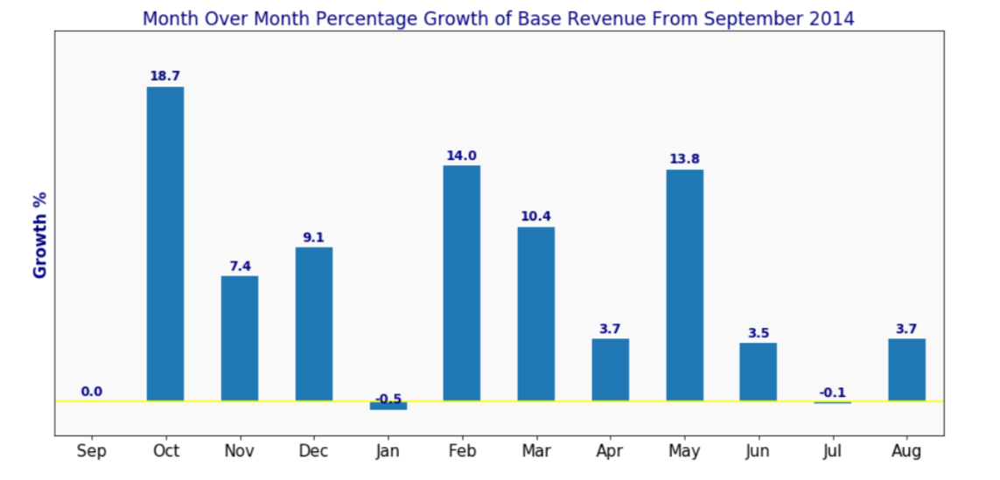
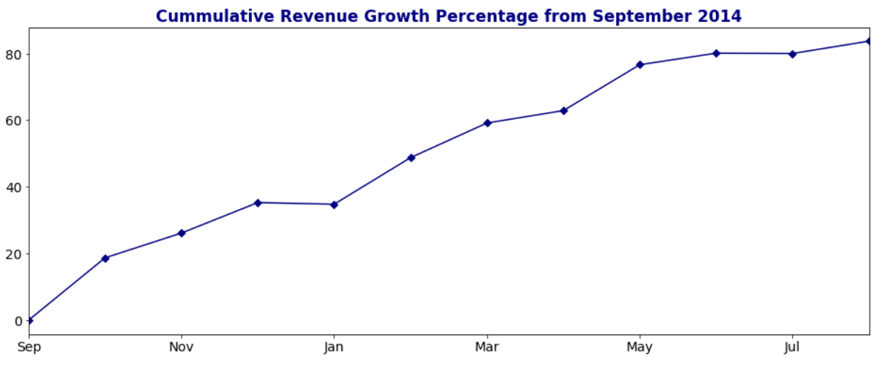

# Group members:
Ishita Ghosh (ishita2019)
Dipika Jiandani (dipika7)
Sayali Mohite (mohite2)

## Project Discription:
Yellow Cabdrivers are struggling to survive in the era dominated by Uber and striving to fight a losing battle. New York yellow cab service has the largest cab fleets in the US & they are facing extinction. According to reports, approximately 40% of the 7000 strong cab fleet had not had an average rate.

**Project Name:** Cab Service Data Analysis of NYC data
**Project Types:** Type II

## Hypothesis 1 
*Metropolitan areas of NYC have higher tipping rates considering the income level of the people living in these areas.
## Analysis
1a: Finding out the relationship between tipping rates and the Pick up and Drop off locations  

1b: Determining the most popular pick up and drop off locations in NYC  

1c: Analyzing if there's a correlation between tipping rates and the weekdays  

   

## Hypothesis 2 
*Increase in Revenue Growth for Uber dataset.
## Analysis
2a: Visualizing the demand: number of Uber trips per day. 

2b: The effect of time on demand for Uber rides: distribution per month(Peak hours versus Off-Peak hours). 

2c: Month over Month Base Revenue Growth: how fast has Uber grown in the period?  

2d: Cummulative Revenue Growth Percentage for Uber cab service.

## Hypothesis 3
*Drop in the revenue growth for NYC Yellow cab service in the era dominated by for-hire-service
## Analysis
3 a: Visualizing the demand: number of Yellow Cab trips per day. 

3 b: Estimating the effect of time on demand for Yelow Cab serive: distribution per hour, weekday, and month  

3 c: Analyzing Monthly Base Revenue: The NYC market worth in the period

## Datasets used:
http://www.nyc.gov/html/tlc/html/about/trip_record_data.shtml

Yellow Cab Data 2017
Yellow Cab Data 2018
Yellow Cab Data 2019
FHV Cab Data 2019
Uber Collated data
Taxi-zone Lookup 

 
## Required Packages:
The code is written in a Jupyter Notebook and using following packages:

Numpy (version: 1.11.2)
Pandas (version: 0.19.2)
Matplotlib (version: 1.5.3)
Seaborn (version: 0.6.0)

